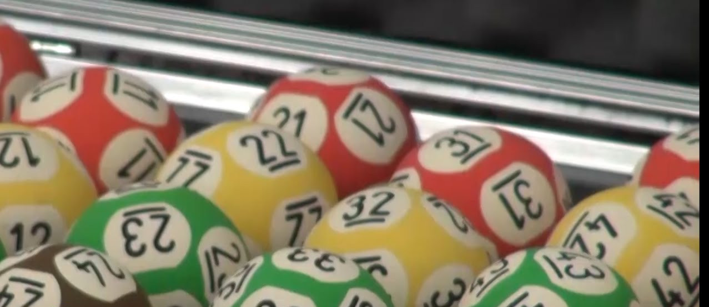

# MegaSena JS



## Apresentação
Mais um fim de ano, mais uma MegaSena da Virada, mais uma vez o desafio de escolher números sem viés para gerar as minhas apostas. Dessa vez fiquei imaginando como simular o globo de sorteio da MegaSena com mais autenticidade, dando um toque de realismo à geração dos números. A ciência adicionada a essa nova versão é o ingrediente de aleatoriedade real que foi adicionado. Além da combinação de números pseudo aleatórios que fazem variar aleatoriamente o intervalo de embaralhamento dos números, é preciso comandar manualmente a geração de cada número. Isso confere imprevisibilidade ao evento, criando um sorteio com aleatoriedade verdadeira.

## Aviso Legal
Antes de prosseguir, sempre é bom lembrar que **NÃO EXISTE MÉTODO CIENTÍFICO PARA GANHAR NA MEGASENA OU EM QUALQUER SORTEIO**.

A probabilidade de acertar um jogo de 6 dezenas na Megasena é uma em 50.063.860, independentemente do método utilizado para gerar a aposta. Não se iluda, esse repositório foi criado apenas por diversão e para apresentar um método interessante de gerar alguns números aleatórios. Não acredite em métodos ou sistemas para ganhar na loteria. Isso **NÃO EXISTE**. Não jogue seu dinheiro no lixo acreditando que vai ganhar alguma coisa. É mais fácil [morrer num acidente de avião](https://www.elitedaily.com/news/world/people-terrified-plane-crashes-even-though-rare/977885) do que ganhar na Megasena. Dito isto, continue lendo e divirta-se por sua conta e risco. Boa sorte!!

## Requisitos
* NodeJS - O desenvolvimento foi feito com a versão 23.5.0, mas você pode testar com outras versões.
* NPM ou Yarn

## Instalação
Baixe o código deste repositório na sua pasta local de projetos
```
git pull https://github.com/hbolzan/megasena-js.git
```

Navegue para a pasta do projeto e instale os pacotes
```
cd megasena-js
npm install
```
ou
```
yarn install
```

## Princípio de funcionamento
A peça principal do gerador é a classe `Cage` que simula um globo de sorteio de bolas. O construtor da classe não exige uma chamada com `new`. Ela recebe o contexto, através do qual são injetadas as dependências, e o número máximo de bolas que, no caso da MegaSena, deve ser 60.
O objeto instanciado por essa classe contém um estado mutável no qual são mantidos os parâmetros e o estado atual do globo.

Uma chamada para o método `startRolling` ativa um timer cujo timeout é definido atualmente dentro de uma faixa de valores parametrizáveis. Quando o evento do timer é disparado, as bolas são embaralhadas e o timer é redefinido com um novo timeout aleatório. Esses embaralhamentos que ficam ocorrendo em períodos curtos tentam simular os agitadores do globo da megasena que ficam continuamente embaralhando as bolas. 

Quando o método `pop` é chamado, o timer atual é interrompido através do método `stopRolling` para evitar que ocorra um embaralhamento durante a extração de uma bola. Em seguida a última bola da fila é extraída e o método `startRolling` é chamado para reativar o embaralhamento periódico. A chamada para o método `pop` deve ser feita manualmente para conferir imprevisibilidade ao momento da extração da bola, adicionando assim o ingrediente de aleatoriedade verdadeira ao sorteio.
